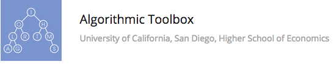

```
Roberto Nogueira  BSd EE, MSd CE
Solution Integrator Experienced - Certified by Ericsson
```

# Algorithmic Toolbox



**About the Course**

Master Algorithmic Programming Techniques. Learn algorithms through programming and advance your software engineering or data science career.

## Contents

```
WEEK 1
Welcome
[ ] A plus B
[ ] Maximum Pairwise Product

WEEK 2
Introduction
[ ] Logarithms
[ ] Big-O
[ ] Growth rate
[ ] Programming Assignment 1: Introduction

WEEK 3
Greedy Algorithms
[ ] Greedy Algorithms
[ ] Fractional Knapsack
[ ] Programming Assignment 2: Greedy Algorithms

WEEK 4
Divide-and-Conquer
[ ] Linear Search and Binary Search
[ ] Polynomial Multiplication
[ ] Master Theorem
[ ] Sorting
[ ] Quick Sort
[ ] Programming Assignment 3: Divide and Conquer

WEEK 5
Dynamic Programming
[ ] Change Money
[ ] Edit Distance
[ ] Knapsack
[ ] Maximum Value of an Arithmetic Expression
[ ] Programming Assignment 4: Dynamic Programming
```


